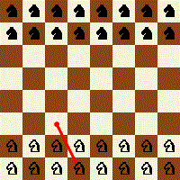
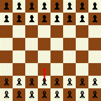
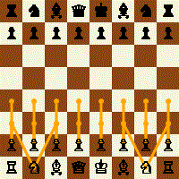
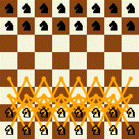
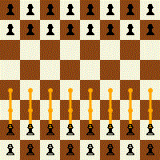
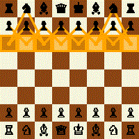
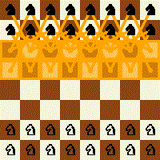
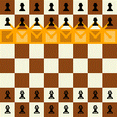

# Game

This repo is a starter kit for creating basic games using autonomous coding agents.

> [!WARNING]
> Work in progress. Not everything you see here is final.

- TODO  
  - Missing mocks: renderers, GIF composer and IO need mockable interfaces so unit tests can isolate.  
  - Move rendering/IO-heavy tests to an integration test project (`Game.*.Tests.Integration`); keep pure logic tests in unit projects with mocks.  
  - Split core vs chess: decouple `Game.Core` (generic policy/state/action) from `Game.Chess` specifics so other games can be implemented using a domain-agnostic core.  

## Output Preview

Below are the reference render GIFs produced by the `Game.Chess.Renders` tests.

### Actions timeline

### Candidate actions timeline

### Threat timeline

