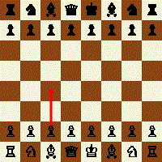
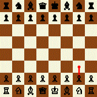

# Game

This repo is a starter kit for creating basic games using autonomous coding agents.

> [!WARNING]
> Work in progress. Not everything you see here is final.

- TODO  
  - Missing mocks: renderers, GIF composer and IO need mockable interfaces so unit tests can isolate policy/state/action.  
  - Move rendering/IO-heavy tests to an integration test project (`Game.*.Tests.Integration`); keep pure logic tests in unit projects with mocks.  
  - Split core vs chess: decouple `Game.Core` (generic policy/state/action) from `Game.Chess` specifics so other games can be implemented without chess coupling.  

# test 1

 

# test 2

<table>
  <tr>
    <td></td>
    <td></td>
  </tr>
</table>

# test 3

