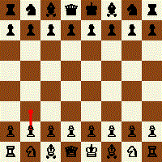

# Game

> [!NOTE]
> This repo serves as a best-practice example for autonomous coding agents to replicate composable game architecture patterns using test-driven development.

- History vs Entity  
  - History holds rules and (policy, state, action).  
  - Entity holds domain objects (boards, pieces, patterns).  

- TODO  
  - Missing mocks: renderers, GIF composer and IO need mockable interfaces so unit tests can isolate policy/state/action.  
  - Move rendering/IO-heavy tests to an integration test project (`Game.*.Tests.Integration`); keep pure logic tests in unit projects with mocks.  
  - Split core vs chess: decouple `Game.Core` (generic policy/state/action) from `Game.Chess` specifics so other games can be implemented without chess coupling.  

  
  
  

